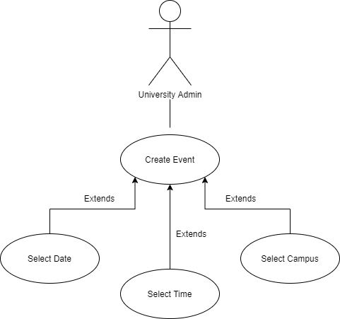
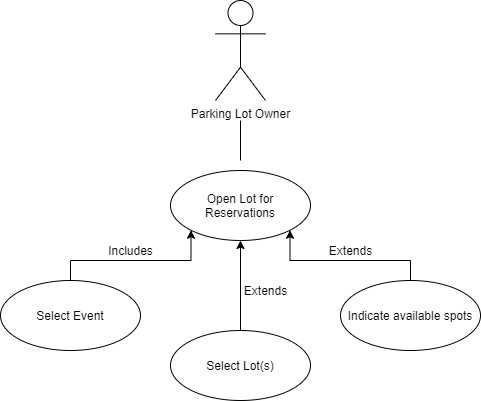

Requirements Definition

# Big Blue's Parking Genie

## 1. Introduction and Context

*Finding convenient parking locations can be difficult when attending large university sponsored events, including sporting events. The ease at which one obtains and uses their parking spot may ruin or enrich such experiences. For example, consider attendance of an Aggie football game. Some parking is available at the Maverick Stadium parking lot but depending on arrival time it may quickly become scarce. Other parking lots are available around the university, but their locations may be less clear, especially to those unfamiliar with campus. The location of and navigation to suitable parking spots can be a stressful experience. This stress is only compounded by other factors such as heavy traffic, cost of the spot, and distance from the event. Big Blue’s Parking Genie (Genie) intends to make parking a more positive experience at Utah State University by collecting the universal parking experience into a single tool.*

*This document details the user goals, requirements, and features of the Genie web application. The aim of Genie is to ease the discovery, purchase, and access of parking spots for patrons of Utah State University events. These patrons may be public customers, students, or others who attend events. Additional users of Big Blue’s Parking Genie include university personnel, parking lot owners, and parking attendants. Section 2 of this document outlines the goals and process of these users. Section 3 details the requirements necessary for the app to function as intended. Section 4 introduces additional non-functional requirements to the application. The Genie development team will deliver the initial deployment before May 2021. Once complete, Genie should be able to assist a variety of people using either desktop or mobile devices. Potential future features and a glossary are included in sections 5 and 6 respectively.*

## 2.	Users and their Goals

*Users of Big Blue's Parking Genie fall into five main categories. These categories include Public Users, Customers, Lot Attendants, Lot Owners, and University Administrators. Each user type has all of the permissions of lower user types. For example, a Parking Lot Owner has management ability for his owned lots, lot attendant privileges for each lots he owns, and the basic system privileges afforded to each customer. While user permissions are backwards-inclusive, each user type still has distinct goals. User goals and permissions are detailed in Table 1. Some common use cases are detailed in Figures 1-8.*

**Table 1**  

| **Actor** | **Goals** | **Permissions** |
|-|-|-|
| Public | Users without an account can browse the front-facing page and sign up for an account. | Front-facing page permissions; create accounts. |
| Client | View and select upcoming events, view and select available parking lots for each event, purchase parking spots for events, manage parking reservations, and view account balance and information. | Basic viewing and reservation permissions |
| Lot Attendant | View all reservations for the current/next event, check clients into parking spots. | Client permissions, reservation permissions. |
| Lot Owner | Add or remove registered lots, add attendants for lots, set prices and types of parking spots. | Attendant permissions, lot management permissions. |
| University Admin | View and manage all parking lot owners, their lots, and lot attendants. Manage and add upcoming events. | Owner permissions, event permissions. |

  
**Figure 1.** Admin Adds Event  

  
**Figure 2.** Owner Adds Parking Lot  

  
**Figure 3.** Owner Adds Parking Spot  

  
**Figure 4.** Attendant Checks In Customer  

  
**Figure 5.** Public User Creates Account  

  
**Figure 6.** Owner Opens Lot for Reservations  

  
**Figure 7.** Customer Reserves Parking Spot  

  
**Figure 8.** Customer Uses their Reserved Parking Spot  

## 3.	Functional Requirements

1. Sign-up Page (no permissions)
    - Allows for sign up and registration of diffrent actors
    - Client and Lot Owners can register as such
2. Map Page (Client-level permissions)
    - Contains a map of avalible lots for a given event
3. Lot Page (Client-level permissions)
    - Linked from map page
    - Contains specific information about the lot including owner name, number of spots, reservation options, etc.
4. Lot Attendant Page (Lot Attendent permissions)
    - Allows Lot Attendants to view current reservations and events.
    - Allows Lot Attendants to check-in Clients.
5. Lot Owner Page (Lot Owner permissions)
    - Allows Lot Owners to add/remove avalible lots, set reservation price for lot, and manage parking space types
6. Event Management Page (University Admin permissions)
    - Allows University Admins to create new events and manage lot owners.
7. Lot Attendant admin page (Lot Owner permissions)
    - Allows Lot Owners and University Admins to add/remive Lot attendents
    - University Admins can also add new University Admins
    - Sends a private sign up link to new new Attendent/Admin
8. Main Page (all permissions)
    - Allows navigation of all pages based on permissions of diffrent actors
    - Shows information like current reservations and event information
9. About Page (no permissions)
    - Information page
    - Tells potential actors about Parking Genie

## 4.	Non-functional Requirements

1. *During each phase (similar to an Agile Sprint) a project leader will be nominated who will track the effort and hours spent working on the project by individual team members. This effort will typically be measured using Canvas points as a guideline for difficulty levels.*
2. *The application will utilize a database to track accounts and user permissions.*
3. *Project progress and deliverables will be managed via GitHub and the Git version control system.*
4. *The web application should be able to handle multiple users simultaneously making parking spot reservations at any time.*
5. *User accounts will require passwords of length 8 characters or more*
6. *The system must be able to store University events registered at least 6 months in advance. This will allow University admin users to add events as semester schedules are created.*
*Further non-functional requirements may be added as the project progresses.*

## 5.	Future Features

1. *Add a request system to regulate the process by which users submit applications to the university admin to be added as lot owners.*
2. *Rating system which allows users to rate their liking of the parking spot they used*
3. *Add process of verifying the proper ownership of lots*

## 6.	Glossary

**Authentication**  
The process used site-wide to verify the identity of a user, access their account details, and follow proper use cases based on the permissions of the user. Authentication takes place at login.

**Front-Facing**  
The portion of Big Blue's Parking Genie which is available to the public without user accounts can be referred to as the front-facing end of the application. Here potential users from the public can browse the features of the application and choose to sign up for an account.

**Permissions**  
Permissions refer to the access level associated with each user account. Based on the account type, different users have access to different views and functionalities within the site.

**User**  
In the documentation for Big Blue's Parking Genie, users refers to any potential individual who uses the application. Each user can be categorized as one of several user types defined in Section 2 of this document.

